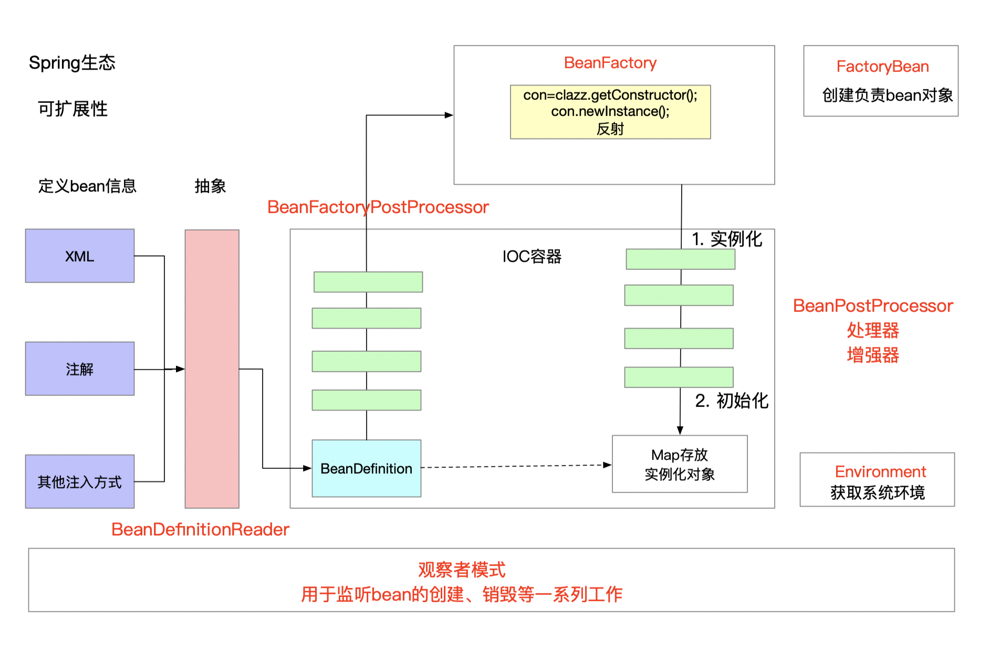

### 理解SpringCore


#### 理解Bean注入

1. 如何注入一个对象

1.1 定义服务Service
```java
public class UserService {

}
```

1.2 在服务中引入Service

```java
public class UserController {

    private UserService userService;

    public UserService getUserService() {
        return userService;
    }

    public void setUserService(UserService userService) {
        this.userService = userService;
    }
}
```

1.3 编写注入方法

```java
public class TestSetInjection {
    public static void main(String[] args) throws Exception{
        UserController userController = new UserController();
        UserService userService = new UserService();
        System.out.println(userService);
        // 将userService注入到userController中

        // 1. 获取class对象
        Class<? extends UserController> clazz = userController.getClass();

        // 2. 获取属性
        Field userServiceField = clazz.getDeclaredField("userService");
        // 也可以不设置可见性
        userServiceField.setAccessible(true);

        // 3. 获取对应的set方法
        String name  = userServiceField.getName();
        String methodName = "set" + name.substring(0,1).toUpperCase() + name.substring(1,name.length());
        Method method = clazz.getMethod(methodName, UserService.class);

        // 4. 调用setUserService方法
        method.invoke(userController, userService);
        System.out.println(userController.getUserService());
    }
}

```

#### 理解Autowired

1.1 编写自定义注解
```java
@Retention(RetentionPolicy.RUNTIME)
@Target(ElementType.FIELD)
@Inherited
@Documented
public @interface Autowired {
}
```

1.2 编写Service
```java
public class UserService {
}
```

1.3 编写Controller自动织入Service

```java
public class UserController {
    @Autowired
    private UserService userService;

    public UserService getUserService() {
        return userService;
    }
}
```

1.4 编写工厂方法注入bean

```java
public class TestAutowired {

    public static void main(String[] args){
        UserController userController = new UserController();

        // 获取clazz对象
        Class<? extends UserController> clazz = userController.getClass();
        Stream.of(clazz.getDeclaredFields()).forEach(
                field -> {
                    // 判断属性是否有注解
                    Autowired annotation = field.getAnnotation(Autowired.class);
                    if(annotation != null){
                        field.setAccessible(true);
                        // 获取当前属性的类型，有了类型可以创建具体的对象
                        Class<?> type = field.getType();
                        // 创建对象
                        try {
                            // 类似于demo1中的new Service
                            Object instance = type.newInstance();
                            // 给属性赋值
                            field.set(userController, instance);
                        } catch (InstantiationException e) {
                            e.printStackTrace();
                        } catch (IllegalAccessException e) {
                            e.printStackTrace();
                        }
                    }
                }
        );
        System.out.println(userController.getUserService());
    }
}

```

#### 了解Spring启动时类bean的实例化及初始化

1.1 定义Service
```java
public class UserService {
}
```

1.2 XML注入bean
```xml
    <bean id="userService" class="demo3.UserService"/>
```

1.3 模拟Spring bean加载过程

```java
public class TestApplicationContext {
    public static void main(String[] args) {
        ApplicationContext context = new ClassPathXmlApplicationContext("spring.xml");
    }
}
```

1.4 核心源码

org.springframework.context.support.AbstractApplicationContext.refresh

```java
@Override
	public void refresh() throws BeansException, IllegalStateException {
		synchronized (this.startupShutdownMonitor) {
			// Prepare this context for refreshing.
			prepareRefresh();

			// Tell the subclass to refresh the internal bean factory.
			ConfigurableListableBeanFactory beanFactory = obtainFreshBeanFactory();

			// Prepare the bean factory for use in this context.
			prepareBeanFactory(beanFactory);

			try {
				// Allows post-processing of the bean factory in context subclasses.
				postProcessBeanFactory(beanFactory);

				// Invoke factory processors registered as beans in the context.
				invokeBeanFactoryPostProcessors(beanFactory);

				// Register bean processors that intercept bean creation.
				registerBeanPostProcessors(beanFactory);

				// Initialize message source for this context.
				initMessageSource();

				// Initialize event multicaster for this context.
				initApplicationEventMulticaster();

				// Initialize other special beans in specific context subclasses.
				onRefresh();

				// Check for listener beans and register them.
				registerListeners();

				// Instantiate all remaining (non-lazy-init) singletons.
				finishBeanFactoryInitialization(beanFactory);

				// Last step: publish corresponding event.
				finishRefresh();
			}

			catch (BeansException ex) {
				if (logger.isWarnEnabled()) {
					logger.warn("Exception encountered during context initialization - " +
							"cancelling refresh attempt: " + ex);
				}

				// Destroy already created singletons to avoid dangling resources.
				destroyBeans();

				// Reset 'active' flag.
				cancelRefresh(ex);

				// Propagate exception to caller.
				throw ex;
			}

			finally {
				// Reset common introspection caches in Spring's core, since we
				// might not ever need metadata for singleton beans anymore...
				resetCommonCaches();
			}
		}
	}
```

org.springframework.beans.factory.BeanFactory

```java
/**
 * <p>Bean factory implementations should support the standard bean lifecycle interfaces
 * as far as possible. The full set of initialization methods and their standard order is:
 * <ol>
 * <li>BeanNameAware's {@code setBeanName}
 * <li>BeanClassLoaderAware's {@code setBeanClassLoader}
 * <li>BeanFactoryAware's {@code setBeanFactory}
 * <li>EnvironmentAware's {@code setEnvironment}
 * <li>EmbeddedValueResolverAware's {@code setEmbeddedValueResolver}
 * <li>ResourceLoaderAware's {@code setResourceLoader}
 * (only applicable when running in an application context)
 * <li>ApplicationEventPublisherAware's {@code setApplicationEventPublisher}
 * (only applicable when running in an application context)
 * <li>MessageSourceAware's {@code setMessageSource}
 * (only applicable when running in an application context)
 * <li>ApplicationContextAware's {@code setApplicationContext}
 * (only applicable when running in an application context)
 * <li>ServletContextAware's {@code setServletContext}
 * (only applicable when running in a web application context)
 * <li>{@code postProcessBeforeInitialization} methods of BeanPostProcessors
 * <li>InitializingBean's {@code afterPropertiesSet}
 * <li>a custom init-method definition
 * <li>{@code postProcessAfterInitialization} methods of BeanPostProcessors
 * </ol>
 *
 * <p>On shutdown of a bean factory, the following lifecycle methods apply:
 * <ol>
 * <li>{@code postProcessBeforeDestruction} methods of DestructionAwareBeanPostProcessors
 * <li>DisposableBean's {@code destroy}
 * <li>a custom destroy-method definition
 * </ol>
```

1.5 Spring特性

不需要自己创建对象，使用IOC容器+工厂模式创建，需要的时候去容器中拿就可以，Spring是一种生态，具有高可扩展性。




#### 如何读源码

1. 会基本的使用整个框架
2. 梳理整体流程，不要求每个细节都清楚，了解整体脉络，通过注解、名称猜测基本方法，跟经验做匹配
3. 深入具体细节，做好记录
4. 重复2-3, 画出整体框架
5. 80%猜测+20%验证


